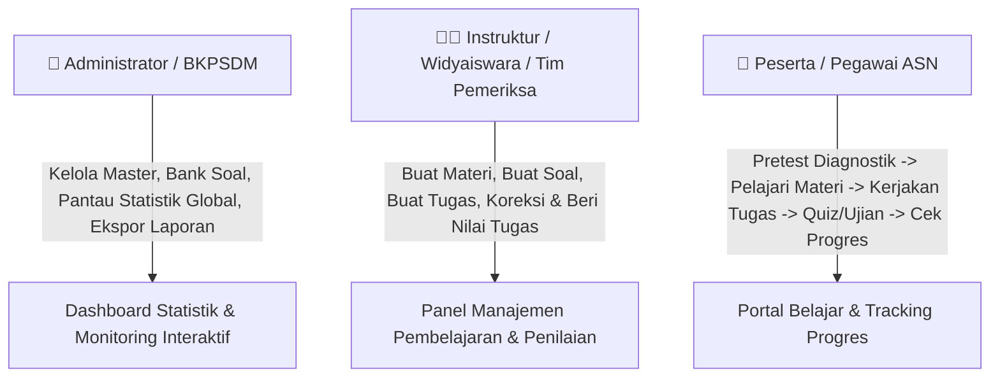
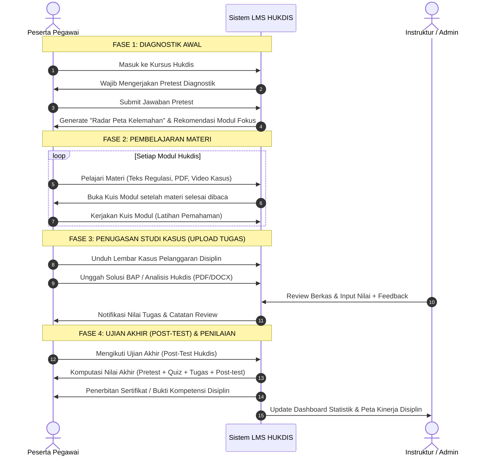
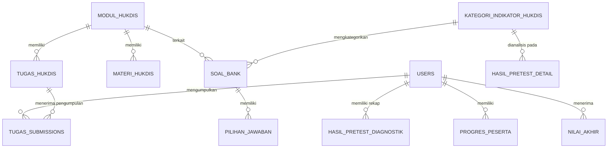

# 🏛️ BLUEPRINT & SPESIFIKASI SISTEM LMS PEMBELAJARAN HUKDIS (HUKUMAN DISIPLIN)
**Dokumen Perancangan Arsitektur, Alur Mekanisme, dan Rombak Fitur LMS Khusus Pembelajaran & Penegakan Disiplin ASN/Pegawai**

---

## 📌 1. LATAR BELAKANG & VISI TRANSFORMASI

Sistem LMS ini dirombak secara menyeluruh dari format pelatihan umum menjadi **LMS Spesialis Pembelajaran Hukuman Disiplin (HUKDIS)**. 

### 🎯 Tujuan Utama:
1. **Peningkatan Pemahaman Disiplin**: Membekali seluruh pegawai dan pejabat penilai dengan penguasaan regulasi disiplin (PP 94 Tahun 2021, Kode Etik, Perka BKN, Tata Cara Penjatuhan Hukdis).
2. **Diagnostik & Pemetaan Titik Lemah (Weakness Diagnostic)**: Melalui *Pretest*, sistem langsung mendiagnosa pasal, tahapan, atau kategori hukdis mana yang belum dikuasai oleh pegawai/unit kerja.
3. **Pembelajaran Aplikatif Berbasis Kasus**: Tidak hanya teori teks/video, tetapi ada **Upload Tugas Studi Kasus** (misal: penyusunan Berita Acara Pemeriksaan (BAP), analisis tingkat pelanggaran, simulasi SK Hukdis).
4. **Dashboard Statistik & Analitik Eksekutif**: Manajemen / BKPSDM / Admin memiliki dashboard visual interaktif untuk memonitor progres, tingkat kelulusan, dan peta unit kerja yang paling rawan/lemah pemahaman disiplinnya.
5. **Antarmuka Bersih, Simpel & Modern (Clean Modern LMS)**: Menghilangkan kerumitan menu navigasi lama dan menggantinya dengan layout LMS modern yang fokus pada alur belajar bertahap.

---

## 👥 2. ROLE & HAK AKSES SISTEM



1. **Peserta (Pegawai / Pejabat)**:
   - Wajib mengikuti Pretest Diagnostik di awal.
   - Mengakses Modul Pembelajaran Hukdis (Materi Teks, Regulasi PDF, Video Pembahasan Kasus).
   - Mengunggah berkas penugasan (Upload Tugas Studi Kasus Hukdis).
   - Mengerjakan Quiz per modul dan Ujian Akhir (Post-Test).
   - Melihat progres kompetensi, kartu hasil studi, dan rekomendasi penguatan materi.
2. **Instruktur / Penilai (Widyaiswara / Tim Disiplin)**:
   - Membuat/mengedit Materi, Tugas, dan Soal Quiz/Ujian.
   - Memeriksa pengumpulan tugas peserta, memberikan nilai (skala 0-100) dan catatan masukan (feedback).
   - Melihat progres belajar peserta yang dibimbing.
3. **Administrator (Superadmin / BKPSDM)**:
   - Akses penuh ke CMS Materi, Bank Soal berindikator kategori, dan Penugasan.
   - Dashboard Statistik Interaktif (Radar Chart Kelemahan, Distribusi Nilai, Persentase Kelulusan per Unit Kerja).
   - Ekspor rekap nilai dan status kompetensi ke Excel/PDF.

---

## 🔄 3. MEKANISME & ALUR BELAJAR (LEARNING JOURNEY)



---

## 🛠️ 4. SPESIFIKASI 6 FITUR UTAMA

### 🧩 FITUR 1: SISTEM UPLOAD TUGAS & SERTIFIKAT EKSTERNAL (STANDAR LMS)
Fitur pengumpulan tugas yang fleksibel dan mudah digunakan seperti LMS pada umumnya (Google Classroom / Canvas / Moodle).

* **Tipe Penugasan yang Didukung**:
  1. **Tugas Pembelajaran Umum**:
     - Pengumpulan resume materi, analisis ringkas, esai, studi kasus, slide presentasi, atau lembar kerja.
  2. **Upload Sertifikat Pembelajaran Luar (External Certificate Submission)**:
     - Pengunggahan bukti keikutsertaan pelatihan/seminar eksternal (sertifikat webinar BKN, MOOC, diklat teknis).
     - Kolom input opsional: *Nomor Sertifikat*, *Tanggal Terbit*, dan *Penyelenggara*.
* **Mekanisme Pengunggahan Peserta**:
  - Format file fleksibel: `.pdf`, `.docx`, `.png`, `.jpg`, `.zip` (Maksimal 10MB - 25MB).
  - Kolom teks catatan/keterangan dari peserta.
  - Status pengumpulan jelas: `Belum Mengumpulkan`, `Menunggu Review`, `Perlu Revisi`, `Dinilai (Selesai)`.
  - Informasi batas waktu (*Deadline*) dan status ketepatan waktu.
* **Mekanisme Penilaian Instruktur / Admin**:
  - *Inline Document Previewer* (Lihat dokumen PDF / Gambar sertifikat langsung di browser).
  - Form input nilai (skala 0 - 100) dan kolom feedback/catatan masukan pengajar.
  - Opsi *Minta Upload Ulang / Revisi* jika file tidak terbaca atau belum sesuai.

---

### 📝 FITUR 2: QUIZ / UJIAN TETAP (POST-TEST & KUIS MODUL)
Sistem evaluasi berbasis soal pilihan ganda atau studi kasus singkat untuk mengukur penguasaan materi secara berkala.

* **Kuis Modul (Per Topik)**:
  - Berisi 5–10 soal cepat di akhir setiap modul.
  - Berfungsi sebagai *checkpoint* kelulusan sebelum modul berikutnya terbuka.
* **Ujian Tetap / Post-Test Akhir**:
  - Evaluasi menyeluruh mencakup semua materi Hukdis (25–50 soal).
  - Dilengkapi fitur pengacakan soal (*Random Questions*) dan pengacakan pilihan jawaban (*Random Options*).
  - *Countdown Timer* waktu pengerjaan otomatis.
  - Batas kesempatan mengulang (*Max Retake Attempts*) & opsi *Passing Grade* (KKM, misal: min. 75.00).
  - Tampilan reviu kunci jawaban dan pembahasan komprehensif setelah ujian selesai.

---

### 🎯 FITUR 3: PRETEST DIAGNOSTIK & DETEKSI TITIK LEMAH (WEAKNESS MAPPING)
Fitur unggulan untuk mengukur pemahaman awal sebelum memulai materi serta memetakan aspek disiplin mana yang paling lemah.

* **Kategorisasi Indikator Hukdis pada Soal**:
  Setiap butir soal Pretest ditandai dengan **Indikator Sub-Materi Hukdis**, contoh:
  1. *Kategori A*: Kewajiban & Larangan ASN (Pasal 3, 4, 5 PP 94/2021).
  2. *Kategori B*: Klasifikasi Jenis Hukuman Disiplin (Ringan, Sedang, Berat).
  3. *Kategori C*: Pejabat yang Berwenang Menghukum (PBM).
  4. *Kategori D*: Tata Cara Pemanggilan, Pemeriksaan & Penyusunan BAP.
  5. *Kategori E*: Penjatuhan & Berlakunya Keputusan Hukdis.
  6. *Kategori F*: Upaya Administratif (Keberatan & Banding Administratif ke BAPEK).
* **Laporan Hasil Diagnostik Peserta**:
  - **Radar Chart / Bar Diagram**: Menampilkan persentase penguasaan per kategori indikator.
  - **Identifikasi Titik Lemah**: Otomatis memunculkan pesan peringatan: *"Kelemahan Utama Anda: Tata Cara Pemeriksaan & BAP (Akurasi: 20%)"*.
  - **Rekomendasi Pintar (Smart Recommendation)**: Tautan langsung ke modul materi yang harus dipelajari lebih intensif.

---

### 📊 FITUR 4: FITUR PENILAIAN TERPADU & PERHITUNGAN NILAI AKHIR
Sistem pembobotan nilai yang adil dan terstruktur untuk menentukan predikat kelulusan.

* **Formula Komponen Nilai Akhir**:
  $$\text{Nilai Akhir} = (W_1 \times \text{Pretest}) + (W_2 \times \text{Rata-rata Kuis}) + (W_3 \times \text{Nilai Tugas}) + (W_4 \times \text{Post-Test})$$
  *Default Bobot*:
  - **Pretest**: 10% *(Diagnostik & keaktifan)*
  - **Kuis Modul**: 20% *(Pemahaman per bab)*
  - **Tugas Kasus**: 35% *(Kemampuan praktikal & analisis BAP)*
  - **Post-Test / Ujian**: 35% *(Ujian komprehensif)*
* **Predikat & Status Kelulusan**:
  - **Sangat Kompeten (A)**: Nilai $\ge 85$
  - **Kompeten (B)**: $75 \le \text{Nilai} < 85$
  - **Cukup Kompeten (C)**: $65 \le \text{Nilai} < 75$
  - **Belum Kompeten (D / Mengulang)**: Nilai $< 65$
* **Transkrip Nilai & Cetak Sertifikat**:
  Peserta yang lulus dapat mengunduh sertifikat digital ber-QR Code dengan transkrip rincian nilai per kategori.

---

### 📈 FITUR 5: MONITORING PROGRES KINERJA & BELAJAR
Pelacakan progres yang jelas dan visual agar peserta dan atasan dapat melihat perkembangan belajar secara realtime.

* **Komponen Progres Peserta**:
  - **Progress Bar Keseluruhan**: Persentase kelulusan kursus (0% - 100%).
  - **Step Checklist**: Status per tahapan (`Pretest Selesai` -> `Modul 1-5 Dibaca` -> `Tugas Terunggah` -> `Post-test Lulus`).
  - **Delta Peningkatan Kinerja (Gap Analysis)**:
    Perbandingan langsung skor: $\Delta = \text{Skor Post-Test} - \text{Skor Pre-Test}$ (Menunjukkan seberapa besar efektivitas pembelajaran).
  - **Riwayat Aktivitas & Waktu Belajar**: Pencatatan total menit yang dihabiskan untuk membaca materi dan menyelesaikan tugas.

---

### ⚙️ FITUR 6: PANEL PENGELOLA CMS ALA MOODLE (MODERN MOODLE-STYLE CMS)
CMS mengadopsi standar arsitektur terbaik dari **Moodle LMS 4.x**, namun dengan antarmuka yang jauh lebih modern, bersih (*clean*), dan mudah digunakan (*user-friendly*).

```
+-----------------------------------------------------------------------------------------------------+
| 🏛️ KURSUS: PEMBELAJARAN HUKUMAN DISIPLIN ASN (PP 94/2021)                 [ 🔘 Mode Edit: AKTIF ]  |
+-----------------------------------------------------------------------------------------------------+
| 📑 TOPIK 0: PENGANTAR & DIAGNOSTIK AWAL                                                             |
|   ├── 📋 [Pretest Diagnostik Hukdis] (Prasyarat Wajib)                      ⋮ [Edit ▾] [👁️ Tampilkan] |
|   └── ➕ Tambah Aktivitas atau Sumber Belajar (+ Add an Activity or Resource)                       |
|                                                                                                     |
| 📑 TOPIK 1: KEWAJIBAN, LARANGAN & KODE ETIK ASN                                                      |
|   ├── 📄 [Page] Ringkasan Pasal 3-5 PP 94/2021                              ⋮ [Edit ▾] [👁️ Tampilkan] |
|   ├── 📁 [File] Salinan Resmi PP No. 94 Tahun 2021.pdf                      ⋮ [Edit ▾] [👁️ Tampilkan] |
|   ├── 🎥 [URL/Video] Studi Kasus Pelanggaran Disiplin Jam Kerja             ⋮ [Edit ▾] [👁️ Tampilkan] |
|   ├── ❓ [Quiz] Kuis Pemahaman Topik 1                                      ⋮ [Edit ▾] [👁️ Tampilkan] |
|   └── ➕ Tambah Aktivitas atau Sumber Belajar (+ Add an Activity or Resource)                       |
|                                                                                                     |
| 📑 TOPIK 2: PENUGASAN & STUDI KASUS DISIPLIN                                                        |
|   ├── ✍️ [Assignment] Unggah Analisis Kasus / Sertifikat Diklat Luar         ⋮ [Edit ▾] [👁️ Tampilkan] |
|   └── ➕ Tambah Aktivitas atau Sumber Belajar (+ Add an Activity or Resource)                       |
|                                                                                                     |
| ➕ Tambah Topik / Seksi Baru (+ Add Section)                                                        |
+-----------------------------------------------------------------------------------------------------+
```

#### 💡 Fitur Kunci CMS ala Moodle:
1. **Toggle "Mode Edit" (Turn Editing On / Off)**:
   - Cukup klik 1 tombol sakelar di pojok kanan atas untuk mengaktifkan mode pengeditan kursus.
   - Saat **Mode Edit Aktif**: Muncul kontrol *Drag & Drop* untuk ubah urutan materi/topik, tombol `Edit`, `Sembunyikan dari Peserta (Eye icon)`, `Duplikat`, dan `Hapus`.
2. **Modal "Activity & Resource Chooser" (+ Tambah Aktivitas atau Sumber)**:
   - Saat klik tombol tambah, muncul pop-up kartu visual kategori seperti Moodle:
     * **Aktivitas (Activities)**:
       - ✍️ **Assignment (Penugasan)**: Pengumpulan tugas biasa / upload sertifikat eksternal.
       - ❓ **Quiz (Kuis & Ujian)**: Kuis per modul atau Post-Test akhir ber-timer.
       - 💬 **Feedback / Kuesioner**: Evaluasi kepuasan pembelajaran.
     * **Sumber Belajar (Resources)**:
       - 📄 **Page**: Halaman artikel materi teks & ringkasan pasal (WYSIWYG editor).
       - 📁 **File**: Upload dokumen regulasi PDF, slide PPT, atau dokumen Word.
       - 🔗 **URL / Embed**: Sematkan video YouTube atau tautan eksternal.
3. **Moodle-Style Grader Report (Buku Nilai Terpusat / Gradebook)**:
   - Tabel matriks komprehensif: Baris = Nama Pegawai / NIP / Unit Kerja, Kolom = Pretest, Kuis Topik 1, Assignment, Kuis Topik 2, Post-Test, Nilai Akhir, dan Status Kelulusan.
   - Dilengkapi filter per Unit Kerja / OPD dan tombol ekspor langsung ke Excel/PDF.
4. **Question Bank (Bank Soal ala Moodle)**:
   - Soal dikelompokkan ke dalam **Kategori & Sub-Kategori Indikator Hukdis**.
   - Fitur *Random Question from Category* (Mengambil soal secara acak per kategori untuk Pretest).
5. **Prasyarat & Pembatasan Akses (Access Restrictions & Completion Tracking)**:
   - Checkbox otomatis: Materi ditandai selesai jika sudah dibaca/dibuka.
   - Penguncian otomatis: Topik 1 baru terbuka setelah Pretest dikerjakan; Post-test baru terbuka jika semua tugas sudah dikumpulkan.

---

### 📊 FITUR 7: DASHBOARD INTERAKTIF & STATISTIK ADMIN (EXECUTIVE ANALYTICS)
Dashboard canggih berbasis visualisasi data untuk pengambil keputusan (BKPSDM / Pimpinan Instansi).

```
+---------------------------------------------------------------------------------------------------+
|  🏛️ DASHBOARD ANALITIK PEMBELAJARAN & KINERJA DISIPLIN HUKDIS                                      |
+---------------------------------------------------------------------------------------------------+
| [👥 Total Peserta: 1,240]  [✅ Lulus: 980 (79%)]  [⏳ Sedang Belajar: 210]  [❌ Butuh Remedial: 50]  |
+---------------------------------------------------------------------------------------------------+
|  📈 GRAFIK DISTRIBUSI NILAI & PENINGKATAN       |  🎯 RADAR CHART: TITIK LEMAH KOMPETENSI HUKDIS |
|  [Pretest Rata-rata: 54.2]                     |  - Prosedur BAP: 42% (LEMAH ⚠️)               |
|  [Post-Test Rata-rata: 83.7] (+29.5 Poin 🔥)    |  - Penentuan Jenis Hukuman: 58%              |
|  [Chart Batang: Distribusi Nilai A, B, C, D]    |  - Wewenang Menghukum (PBM): 86% (KUAT ✅)    |
|                                                 |  - Banding & Upaya Administratif: 64%        |
+---------------------------------------------------------------------------------------------------+
|  🏢 ANALISIS KINERJA DISIPLIN PER UNIT KERJA     |  📋 TABEL MONITORING & PENILAIAN CEPAT        |
|  - Unit Kerja A: 88.5% (Tingkat Kepatuhan Tinggi)|  [Filter: Semua Unit Kerja | Status: Perlu Dinilai]|
|  - Unit Kerja B: 72.1%                         |  - Peserta X | Tugas BAP (Menunggu Koreksi)    |
|  - Unit Kerja C: 61.4% (Perlu Pembinaan Khusus) |  - Peserta Y | Post-test: 90 | Lulus          |
+---------------------------------------------------------------------------------------------------+
```

* **Filter Interaktif**:
  - Filter berdasarkan Unit Kerja / Instansi / OPD.
  - Filter berdasarkan Rentang Tanggal / Periode Pelatihan.
  - Filter berdasarkan Status Kelulusan & Kategori Kelemahan.
* **Ekspor Laporan**:
  - Download Laporan Komprehensif Rekap Nilai & Analisis Titik Lemah dalam format Excel (`.xlsx`) dan PDF Resmi BKPSDM.

---

## 🗄️ 5. STRUKTUR DATABASE & RELASI ENTITAS (DATABASE SCHEMA)

Perubahan dan penambahan skema database untuk mendukung 6 fitur di atas:



### 📋 Rincian Tabel Baru & Modifikasi Tabel:

#### 1. Tabel `kategori_indikator_hukdis` *(Master Kategori Diagnostik)*
| Kolom | Tipe | Keterangan |
|---|---|---|
| `id` | BIGINT (PK) | Auto Increment |
| `kode` | VARCHAR(20) | Kode Indikator (misal: `HUKDIS-BAP`, `HUKDIS-PBM`) |
| `nama_kategori` | VARCHAR(150) | Nama Topik (misal: "Tata Cara Pemeriksaan & BAP") |
| `deskripsi` | TEXT | Penjelasan ruang lingkup materi |
| `dasar_hukum` | VARCHAR(255) | Rujukan pasal (misal: "Pasal 23-31 PP 94/2021") |
| `rekomendasi_modul_id` | BIGINT (FK, Nullable) | ID Modul rujukan jika peserta lemah di topik ini |

#### 2. Tabel `tugas_hukdis` *(Master Penugasan Kasus)*
| Kolom | Tipe | Keterangan |
|---|---|---|
| `id` | BIGINT (PK) | Auto Increment |
| `modul_id` | BIGINT (FK) | Terhubung ke tabel `modul` |
| `judul` | VARCHAR(255) | Judul Tugas (misal: "Analisis Kasus Pelanggaran Jam Kerja") |
| `deskripsi_kasus` | LONGTEXT | Narasi kasus pelanggaran yang harus diselesaikan |
| `file_lampiran_soal` | VARCHAR(255) | Template draf BAP atau berkas soal (PDF/DOCX) |
| `deadline` | DATETIME | Batas akhir pengumpulan |
| `bobot_nilai` | DECIMAL(5,2) | Bobot nilai dalam modul / total nilai |
| `format_file_diizinkan` | VARCHAR(100) | Misal: "pdf,docx" |
| `max_file_size_mb` | INT | Maksimal ukuran file (default: 10) |
| `is_active` | BOOLEAN | Status aktif/tutup |

#### 3. Tabel `tugas_submissions` *(Pengumpulan & Penilaian Tugas)*
| Kolom | Tipe | Keterangan |
|---|---|---|
| `id` | BIGINT (PK) | Auto Increment |
| `tugas_id` | BIGINT (FK) | Terhubung ke `tugas_hukdis` |
| `user_id` | BIGINT (FK) | Terhubung ke `users` |
| `file_tugas` | VARCHAR(255) | Path file yang diunggah peserta |
| `file_nama_asli` | VARCHAR(255) | Nama asli file peserta |
| `catatan_peserta` | TEXT | Catatan dari peserta saat submit |
| `nilai` | DECIMAL(5,2) | Nilai dari instruktur (0 - 100) |
| `feedback_instruktur` | TEXT | Catatan review/koreksi dari pemeriksa |
| `status` | ENUM | `submitted`, `need_revision`, `graded` |
| `dinilai_oleh` | BIGINT (FK, Nullable) | User ID instruktur/admin penilai |
| `dinilai_at` | DATETIME | Waktu penilaian dilakukan |

#### 4. Tabel `hasil_pretest_diagnostik` & `hasil_pretest_detail` *(Diagnostik Titik Lemah)*
- Merekam skor total pretest dan rincian persentase kebenaran per `kategori_indikator_hukdis`.
- Menyimpan kategori dengan skor terendah sebagai flag *weakness_point*.

#### 5. Tabel `rekap_nilai_hukdis` *(Nilai Akhir & Predikat)*
- Menyimpan nilai gabungan: Pretest, Rata-rata Kuis, Nilai Tugas Kasus, dan Post-Test.
- Menyimpan predikat kelulusan (`A`, `B`, `C`, `D`) dan status kelulusan (`LULUS` / `TIDAK LULUS`).

---

## 🎨 6. DESAIN ANTARMUKA (UI/UX) LEBIH SIMPEL & MODERN

Transformasi tampilan dari sistem lama yang padat menu menjadi **LMS Modern Sederhana (Clean UI)**:

### 1. Portal Belajar Peserta (User Interface):
* **Top Bar Ringkas**: Menampilkan identitas peserta, Unit Kerja, dan **Pill Status Progres Belajar (%)**.
* **Sidebar Pembelajaran (Course Navigator)**:
  * 📋 Pretest Diagnostik *(Icon Target)*
  * 📚 Modul 1: Dasar Hukum & Kewajiban ASN *(Icon Book)*
  * 📚 Modul 2: Jenis & Hierarki Hukuman Disiplin *(Icon Scale)*
  * ✍️ Tugas Kasus 1: Penyusunan BAP Pelanggaran *(Icon File-Text)*
  * 📚 Modul 3: Tata Cara Penjatuhan Hukdis *(Icon Gavel)*
  * ✍️ Tugas Kasus 2: Perumusan Keputusan Hukdis *(Icon File-Check)*
  * 🏆 Ujian Akhir (Post-Test) *(Icon Award)*
* **Area Belajar Bebas Distraksi**: Konten materi dengan tipografi bersih, tombol *"Tandai Selesai & Lanjut"* di bagian bawah yang jelas.

### 2. Dashboard Admin & Instruktur:
* **Statistik Visual Header**: 4 Kartu KPI Utama dengan tren kenaikan/penurunan angka.
* **Interactive Data Visualization**: Chart.js / ApexCharts modern dengan palet warna elegan (Navy Slate, Emerald Green, Amber Warning, Rose Alert).
* **Direct Action Table**: Tabel penugasan dengan indikator warna status, tombol *Aksi Cepat (Nilai Sekarang)* dengan modal pop-up interaktif.

---

## 🚀 7. TAHAPAN IMPLEMENTASI (ROADMAP PEKERJAAN)

```
+-------------------------------------------------------------------------+
| TAHAP 1: PERSIAPAN DATABASE & STRUKTUR MASTER HUKDIS                     |
| - Migrasi tabel tugas, submissions, indikator hukdis, dan rekap nilai   |
| - Seeding kategori indikator Hukdis PP 94/2021                          |
+-------------------------------------------------------------------------+
                                    │
                                    ▼
+-------------------------------------------------------------------------+
| TAHAP 2: CMS ADMIN (CREATE MATERI, TUGAS & BANK SOAL BERINDIKATOR)      |
| - Form Create/Edit Materi Regulasi & Video                              |
| - Form Create/Edit Tugas Studi Kasus (upload template & setting deadline)|
| - Form Bank Soal dengan tagging Indikator Hukdis                        |
+-------------------------------------------------------------------------+
                                    │
                                    ▼
+-------------------------------------------------------------------------+
| TAHAP 3: ENGINE PRETEST DIAGNOSTIK & RADAR TITIK LEMAH                  |
| - Sistem pengerjaan Pretest Diagnostik                                  |
| - Algoritma kalkulasi skor per kategori & deteksi kelemahan             |
| - Tampilan visual Radar Chart hasil diagnostik ke peserta               |
+-------------------------------------------------------------------------+
                                    │
                                    ▼
+-------------------------------------------------------------------------+
| TAHAP 4: FITUR UPLOAD TUGAS & WORKFLOW PENILAIAN INSTRUKTUR             |
| - Antarmuka upload tugas bagi peserta (drag & drop, preview, submit)    |
| - Panel pemeriksaan tugas untuk instruktur (view doc, input nilai & feedback)|
| - Perhitungan akumulasi Nilai Akhir (Formula Bobot Terpadu)             |
+-------------------------------------------------------------------------+
                                    │
                                    ▼
+-------------------------------------------------------------------------+
| TAHAP 5: DASHBOARD INTERAKTIF ADMIN & REPORTING                         |
| - Pembuatan Widget Statistik Interaktif (ApexCharts/Chart.js)           |
| - Peta Titik Lemah Kompetensi per Unit Kerja                            |
| - Fitur Ekspor Rekap Nilai & Analisis Disiplin ke Excel & PDF          |
| - Polish UI/UX agar simpel, clean, dan responsif di mobile/desktop     |
+-------------------------------------------------------------------------+
```

---

## 📜 8. KESIMPULAN

Rombakan ini mengubah LMS menjadi platform yang **fokus, aplikatif, dan terukur**. Tidak hanya menyajikan materi regulasi Hukdis secara pasif, sistem secara aktif **mendiagnosa kelemahan peserta melalui pretest**, **menguji kemampuan analisis melalui pengunggahan tugas kasus nyata**, dan **memberikan data intelijen kepada pimpinan mengenai peta pemahaman disiplin pegawai di seluruh unit kerja**.
